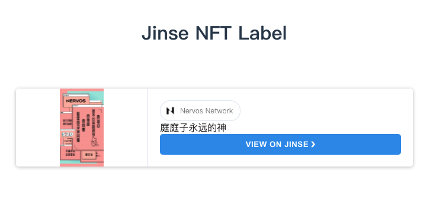

<br /><br />

# MibaoLabel

在你的网站里整一个 NFT! (#>д<)ﾉ

### Usage

在你的网站 Header 中引入

```
<script src="https://unpkg.com/mibaolabel@latest/dist/nft-card.min.js"></script>
```

然后在适当的位置插入你的 NFT 标签

```
<nft-card tokenid="cd01c900-585f-4e52-a056-478df08c3377"></nft-card>
```

### nft-card 标签参数

`tokenid` - 必填！这里是你要展示的 Nervos CKB [金色秘宝](https://explorer.jinse.cc/) NFT token 的 UUID

`width` - 标签的宽度

`height` - 标签的高度

### demo

[胖达的个人博客](https://pandatea.life/post/jin-se-chuan-shuo-biao-qian-qia-xiang-mu-guo-cheng/)

### Development

您要是想做二次开发的话，通过下面的命令就可以搭建一个测试环境啦

```bash
  git clone https://github.com/PandaTea/MibaoLabel.git
  cd MibaoLabel
  yarn install
  yarn run dev:demo
```
